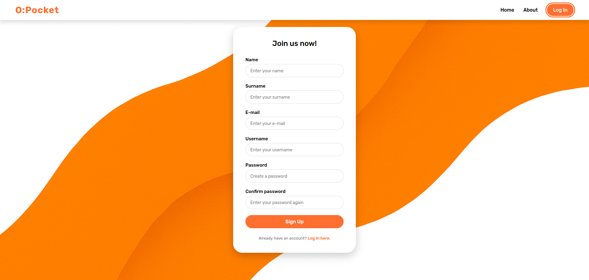
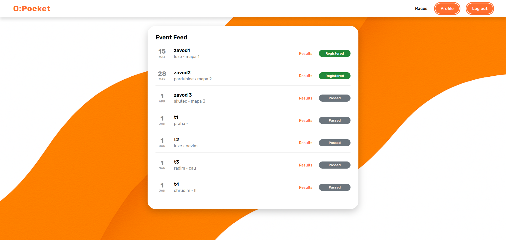
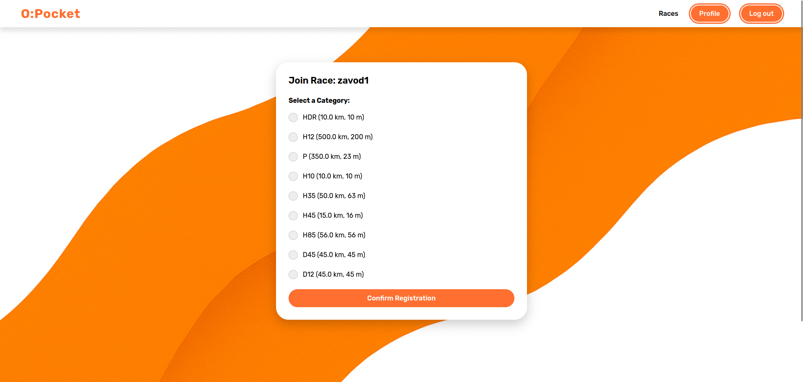
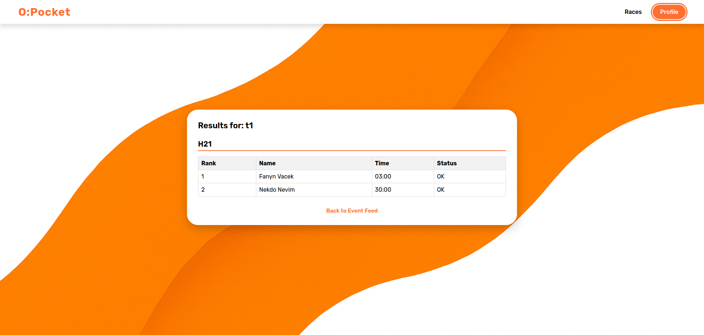
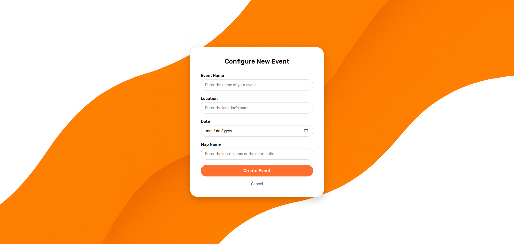
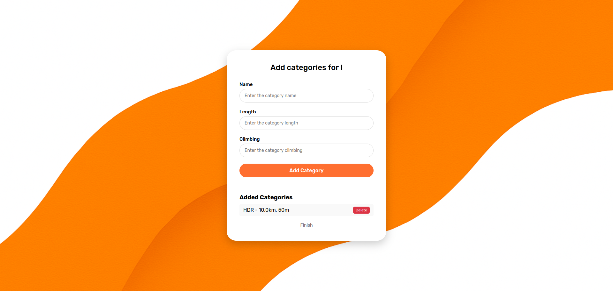
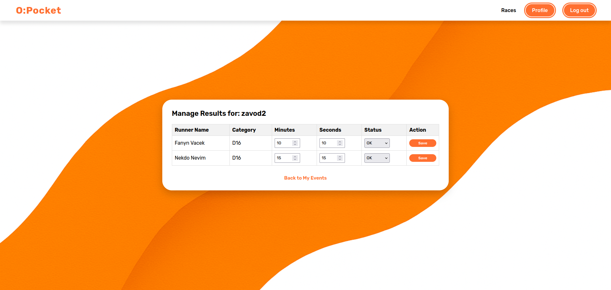

CZ:

Průvodce pro běžce:

1. Založení účtu: Přes tlačítko "Register" si vytvořte profil.
   

2. Přihlášení: Vyhledejte závod v hlavním přehledu (Feed).
   

3. Detail závodu: Klikněte na název závodu, vyberte kategorii a potvrďte účast.
   

4. Profil: Po skončení závodu a zadání výsledků najdete své umístění v sekci "Profile" nebo veřejně ve Feedu.
   

Průvodce pro organizátory:

1. Vytvoření akce: Ve svém profilu zvolte "Create Race".
   

2. Kategorie: U nového závodu musíte přidat alespoň jednu kategorii (např. H21), aby se lidé mohli přihlašovat.
   

3. Zadání časů: Po závodě přejděte do "Results" u daného závodu. Časy zadávejte ve formátu minut a sekund.
   

4. Uložení: Po uložení systém automaticky vygeneruje výsledkovou listinu.
   

EN:

Guide for Runners:

1. Account Creation: Create a profile using the "Register" button.
   

2. Logging in: Find a race in the main overview (Feed).
   

3. Race Details: Click on the race name, select a category, and confirm your participation.
   

4. Profile: After the race has ended and results have been entered, you will find your ranking in the "Profile" section or publicly in the Feed.
   

Guide for Organizers:

1. Event Creation: In your profile, select "Create Race".
   

2. Categories: For a new race, you must add at least one category (e.g., H21) so people can register.
   

3. Entering Times: After the race, go to "Results" for the specific race. Enter times in the format of minutes and seconds.
   

4. Saving: After saving, the system will automatically generate a results list.
   
